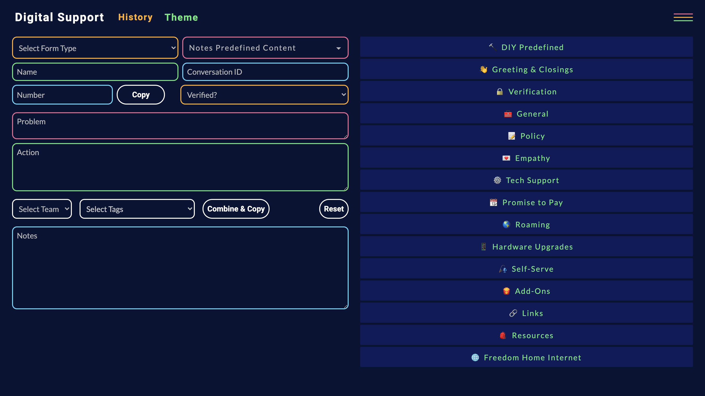

# The Notator

a note formatting application and predefined content manager. Used to format notes to be used on customer accounts and leverage local history to save predefined content and customer note history. 

The notator has only one commit as it was my first project, before I learned Git industry standards. 

Try the notator [here!](https://codepen.io/macknowledged/pen/xxGeyRd?editors=0010)

## Features 

- Form Validation
- Click to Copy 
- Dynamic Forms 
- DIY predefined content (saved in local history)
- Note history (also saved in local history)
- Themes 

## Tech Stack 

- ES6 
- HTML5
- SCSS

